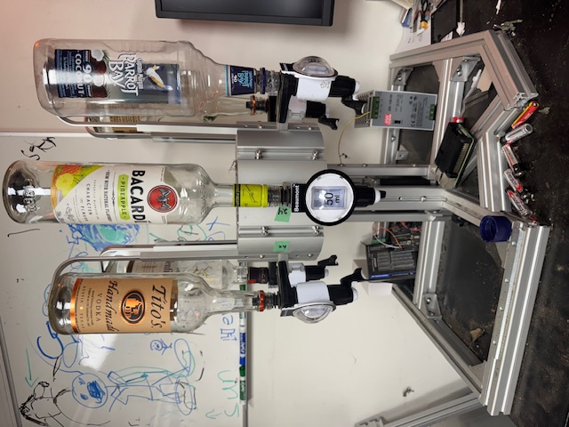
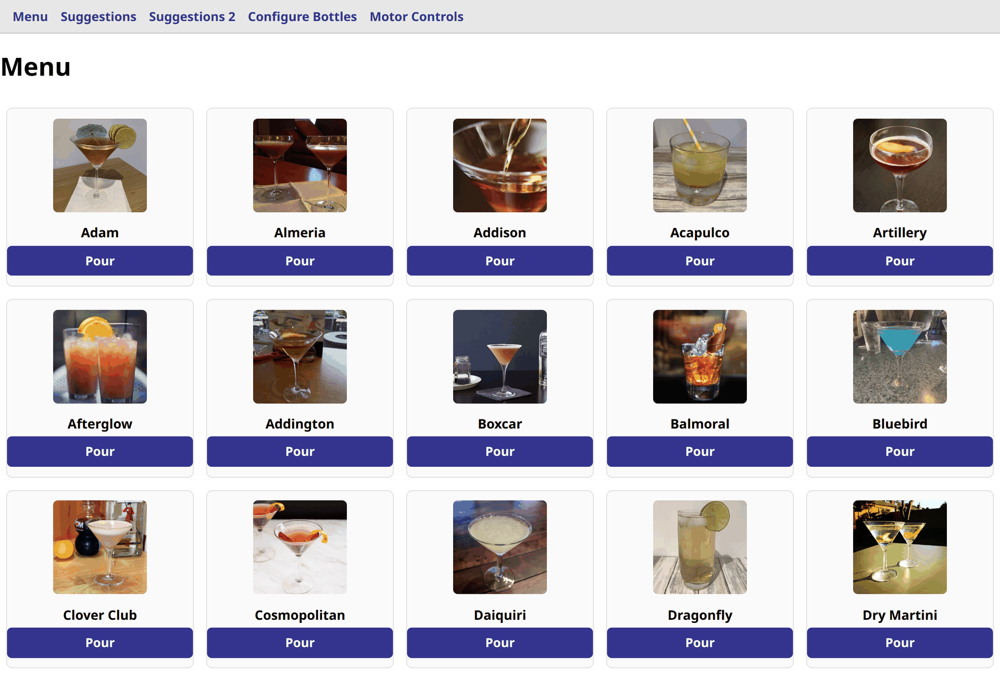
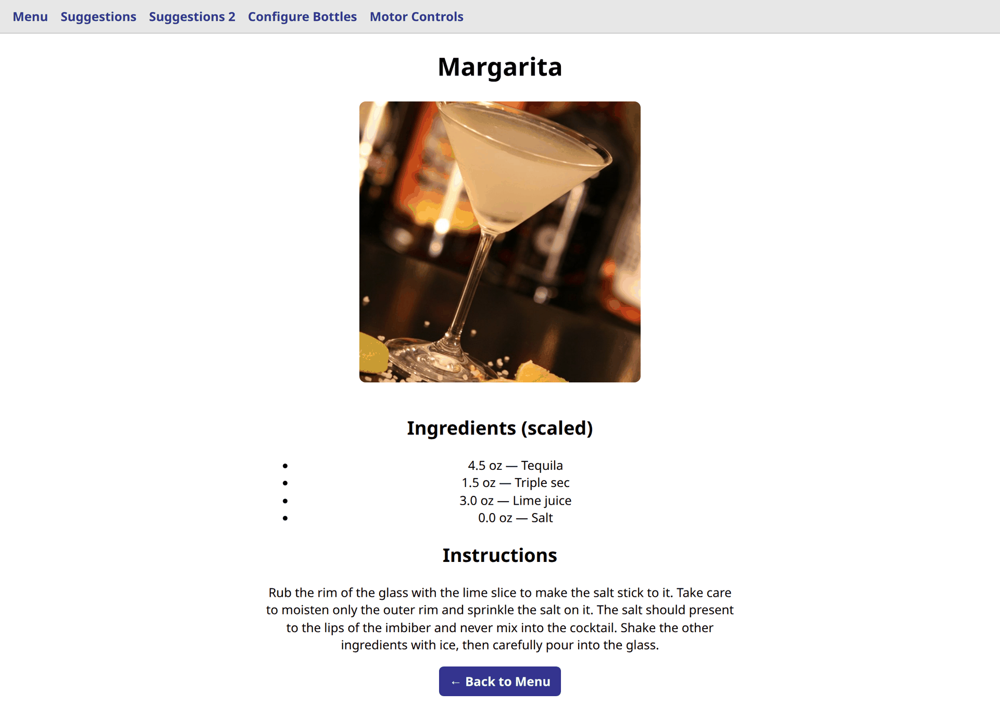
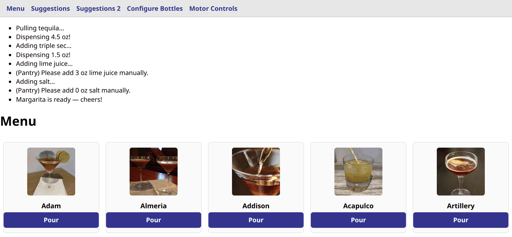
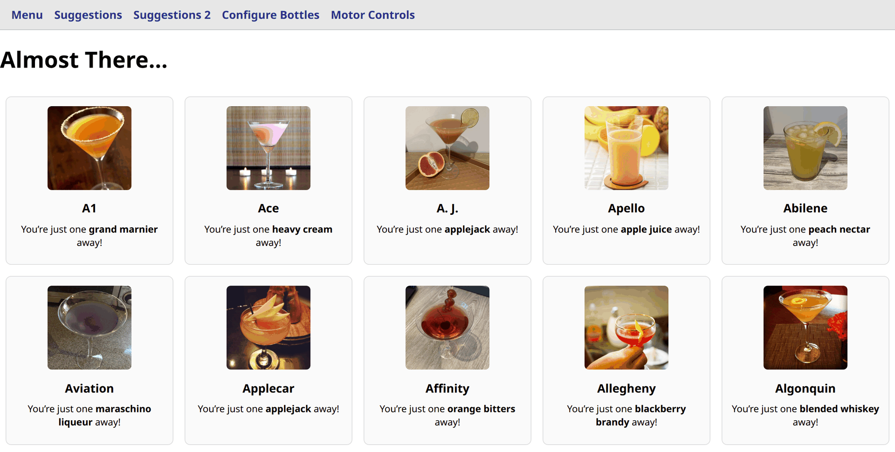
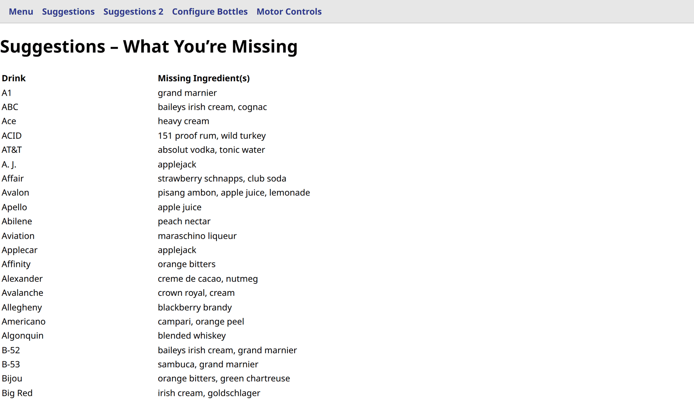
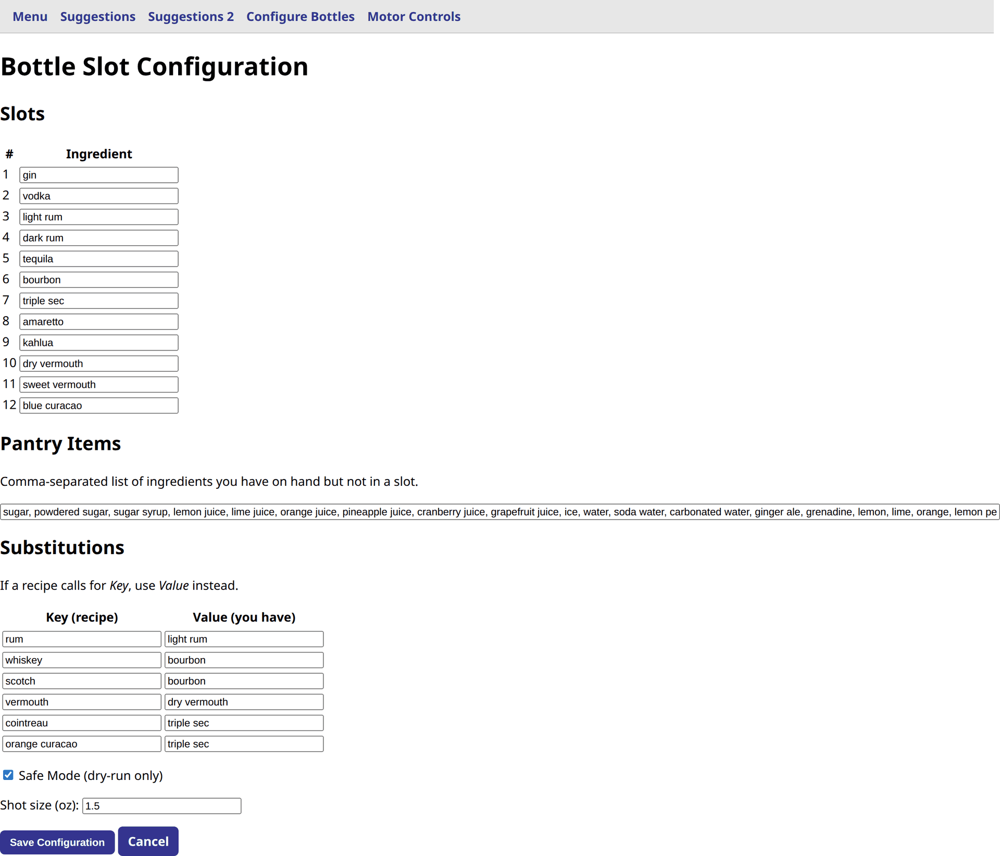
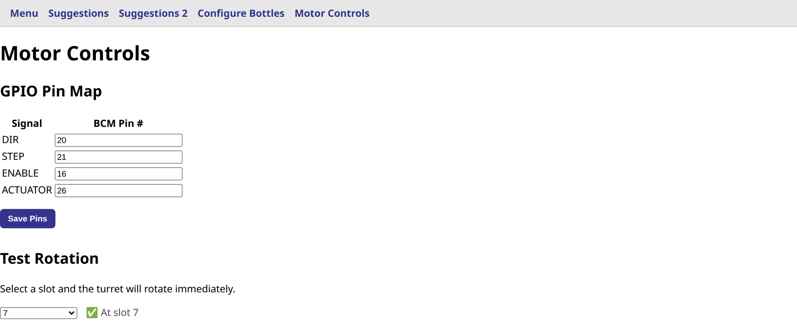

# BarRobot 🍸🤖

An open-source, 12-bottle cocktail turret that dispenses drinks on demand through a Flask-based web + touch-screen UI.  
Built for hobbyists, makers, and thirsty hackers who’d rather code than bartend.

---

## ✨ Key Features
| Category | What it does |
| --- | --- |
| **Hardware** | • 12-slot rotating turret driven by a NEMA-17 + DM542T stepper <br>• Linear actuator (≈ 6 ″ clearance, 0.5 ″ stroke) pushes each bottle’s valve <br>• 24 V / 5 A Mean Well PSU <br>• Optional “Safe Mode” disables the pour GPIOs for dry-runs |
| **Software** | • Flask server & lightweight JS/HTMX front-end <br>• Live recipe sync from [TheCocktailDB](https://www.thecocktaildb.com/) <br>• Dynamic menu shows only makeable drinks based on current slots <br>• Settings page (motor params, theme toggle, default shot size, etc.) <br>• Debug & test pages for turret rotation, actuator jog, GPIO pins <br>• Auto-update: checks GitHub on startup & via manual button, restarts via systemd |
| **Versioning** | Semver-ish thousandths (e.g. **0.004**) stored in `version.txt`, incremented automatically when bundling release ZIPs |
| **Dev-Ops** | • `.service` file for **systemd** auto-start <br>• GitHub Actions stub for lint/tests (extend as you like) |

---

## 📸 The UI

Every page is served by the Flask app at `http://<pi-ip>:5000` and is sized for fat fingers on the
Pi's touchscreen, but it works just as well from a phone or laptop on the same network.
The shots below use a demo 12-bottle setup with Safe Mode on.

### Menu



The menu only lists drinks you can actually make right now — every ingredient has to be in a slot,
in the pantry, or covered by a substitution. Tap **Pour** and the turret does the rest.

### Drink detail



Tapping a thumbnail opens the recipe with quantities already rescaled to whole dispenser shots,
so the amounts you read are the amounts the machine will actually pour.

### Pouring



While a drink is being made, the app logs each step — which bottle it rotated to, how much it
dispensed, and any pantry items you need to top up by hand.

### Suggestions



*Almost There…* lists every recipe you're exactly **one** ingredient away from — a handy shopping
list for the next liquor-store run.

### Suggestions 2



The wider view: every recipe you can't make yet, with all of its missing ingredients listed.

### Configure Bottles



Map each of the 12 turret slots to an ingredient, list the mixers and garnishes you keep on hand,
set up substitutions (`rum` → `light rum`), pick your shot size, and flip Safe Mode for dry runs.

### Motor Controls



Remap the GPIO pins without touching code, then use the slot picker to jog the turret and confirm
each bottle lines up under the actuator.

---

## 🛠️ Hardware Bill of Materials (core)
| Qty | Item | Notes |
| --- | --- | --- |
| 1 | Raspberry Pi 4 (2 GB +) | Controls everything |
| 1 | 24 V 5 A Mean Well LRS-120-24 | Shared PSU |
| 1 | DM542T stepper driver | Micro-stepping friendly |
| 1 | NEMA-17 42 mm stepper, 400 mN·m + | Turret rotation |
| 1 | 12-slot aluminum turret + flange couplers | Houses bottles |
| 1 | Linear actuator (0.5 ″ stroke, 24 V) | Pushes bottle valves |
| 1 | Thrust bearing + MayTec 1.11.0408KT.89SP plate | Supports turret load |
| … | Jumper wires, limit switch (home), misc. M3/M4 hardware | |

*(Full BoM, coupler part #s, and mounting drawings live in `/docs`.)*

---

## 💻 Software Prerequisites

```bash
sudo apt update
sudo apt install python3 python3-venv git
python3 -m venv .venv
source .venv/bin/activate
pip install -r requirements.txt   # Flask, requests, RPi.GPIO, etc.
```

---

## 🚀 Quick-start

```bash
# 1. Clone
git clone https://github.com/cmc0619/barrobot.git
cd barrobot

# 2. Configure bottles (or use the web UI later)
cp bottle_config.sample.json bottle_config.json
nano bottle_config.json   # map each slot to an ingredient

# 3. Run it
python app.py             # dev mode
# or enable the systemd service for auto-start
sudo cp systemd-barrobot.service /etc/systemd/system/
sudo systemctl daemon-reload
sudo systemctl enable --now systemd-barrobot
```

Open `http://<pi-ip>:5000` to view the menu, settings, and debug pages.

---

## ⚙️ Configuration Reference
| File / Page | Purpose |
| --- | --- |
| `bottle_config.json` | Maps turret slots → ingredient names (case-insensitive) |
| **Settings →** UI | Theme, default pour size, GPIO pins, motor params, “Safe Mode” |
| `hardware.py` | Low-level stepper/actuator helper; tweak if you swap drivers |
| `live_Recipes.json` | Auto-downloaded on startup then merged into `recipes.json` |

---

## 🔄 Updates & Releases

*Version file:* `version.txt` (3-digit thousandths)  
The ZIP bundler bumps this automatically—so tag **0.004**, **0.005**, etc.

The Flask app checks GitHub for newer tags on boot.  
From the main page you can also hit **Update Now →**; after a successful pull it restarts the `systemd` service.

---

## 🤝 Contributing

Issues & PRs welcome! For major changes, open an issue first to discuss what you’d like to add or tweak.

---

## 📜 License

[MIT](LICENSE) © 2025 Cliff Campbell (cmc0619)  
MIT – hack it, remix it, just don’t blame me if it pours you a triple.

