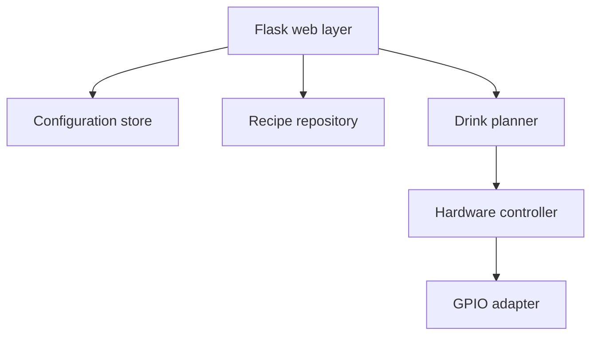

# BarRobot v2 Design

## Status

This document is the implementation contract for the v2 rewrite. The rewrite
keeps BarRobot recognizable to existing users while separating web, recipe,
configuration, drink-planning, and GPIO responsibilities so they can be tested
without a Raspberry Pi.

## Goals

1. Preserve the existing web routes and user workflows.
2. Preserve the 12-slot turret, pantry, substitution, safe-mode, GPIO pin,
   CocktailDB, shortest-path rotation, and acceleration-ramp behavior.
3. Make every non-GPIO behavior testable on a development machine.
4. Prevent overlapping requests from issuing interleaved motor commands.
5. Validate configuration and external recipe data at their boundaries.
6. Make installation from a fresh clone match the README.
7. Keep the Raspberry Pi entry point and systemd deployment simple.

## Non-goals

- Changing the mechanical design, motor driver, or actuator wiring.
- Adding authentication or multi-user accounts.
- Adding a database, JavaScript framework, or background job system.
- Automatically homing a turret that has no implemented home sensor.
- Guaranteeing pour volume without physical calibration.

## Current behavior contract

The following behavior remains supported unless listed under Intentional v2
changes:

| Area | Contract |
| --- | --- |
| Menu | `/` lists recipes whose ingredients are present in a slot, pantry, or valid substitution. |
| Details | `/drink/<id>` shows the cached recipe image, ingredients, and instructions. |
| Suggestions | `/suggestions` shows recipes missing exactly one ingredient. |
| Suggestions 2 | `/suggestions2` shows recipes missing one or more ingredients. |
| Configuration | `/configure` edits 12 slots, pantry items, six substitutions, safe mode, and shot size. Ingredient matching is case-insensitive. |
| Motor controls | `/motor` edits BCM pin numbers; `POST /api/rotate/<1-12>` rotates immediately. |
| Pouring | `/make_drink/<name>` finds a drink case-insensitively, visits ingredients in recipe order, rotates to automatic ingredients, and prompts for pantry ingredients. |
| Recipes | CocktailDB data is downloaded when the recipe cache is absent, converted to ounces, normalized, scaled, and cached locally. |
| Motion | The turret uses the shortest direction; ties use clockwise motion. Safe mode logs simulated motion without GPIO output. |
| Deployment | `python app.py` runs the service on `0.0.0.0:5000`; the included systemd unit remains usable. |

## Review findings

### Correctness and safety

- The application reads `config.json`, but the repository ships
  `bottle_config.json`. A fresh clone silently ignores the shipped slot map.
- The UI describes `shot_size` as one dispense, but pouring calls
  `round(qty_oz)` and never uses `shot_size`. A 1.5 oz quantity therefore
  becomes two actuator presses with Python's rounding behavior.
- `scale_for_slots()` is dead code. Neither drink details nor pouring use it.
- Hardware calls are synchronous but unprotected. Concurrent HTTP requests can
  interleave step and actuator GPIO output.
- Physical turret position is assumed to be slot zero after process startup.
  There is no home-switch implementation, despite the README mentioning one.
- `STEPS_PER_SLOT` truncates 1600 / 12 to 133, accumulating a four-microstep
  error per full revolution.
- GPIO cleanup can attempt to write to pins that have not been initialized.
- A pour is triggered with HTTP GET, so browser prefetching or link scanners can
  theoretically actuate hardware.

### Reliability and maintainability

- Web routes, file I/O, API downloading, recipe math, planning, and GPIO control
  live in two stateful modules with global state.
- Configuration writes are not atomic and malformed JSON prevents startup.
- External API data has no schema boundary and the first menu request can block
  through 26 sequential network timeouts.
- Broad exception handling hides download failures and can cache no useful
  diagnostic context.
- The Flask secret is committed, debug mode is always enabled, and application
  construction has import-time configuration side effects.
- Hardware state is process-local, making multiple WSGI workers unsafe.
- There are no tests, dependency manifests, sample configuration, or CI checks,
  although the README claims some of them exist.
- Template image fallback paths disagree with the actual placeholder location.

## Intentional v2 changes

These are documented behavior changes rather than incidental refactoring:

1. **Canonical configuration:** `config.json` becomes the runtime file.
   On first load, an existing `bottle_config.json` is imported automatically.
   `config.example.json` is shipped for new installations.
2. **Correct dispense calculation:** actuator repetitions are calculated as
   `round(qty_oz / shot_size)` with a minimum of one for a positive automatic
   quantity. This makes the existing `shot_size` setting functional. Operators
   must calibrate `shot_size` to the physical valve output before live use.
3. **Serialized hardware operations:** one process-wide lock covers a complete
   rotate-and-dispense operation. A second pour waits instead of mixing GPIO
   signals with the first.
4. **POST-first pouring:** the menu uses `POST /make_drink/<name>`. `GET` remains
   temporarily supported for bookmark/backward compatibility and is marked for
   removal in a future major version.
5. **Explicit untrusted position:** live mode refuses automatic movement until
   the operator establishes the current slot through the motor-control page.
   Safe mode may simulate from slot zero. This avoids silently treating the
   boot position as mechanically true.
6. **Exact slot-step accumulation:** movement targets are calculated from
   absolute slot boundaries around the 1600-microstep revolution so the four
   remainder steps are distributed instead of lost.
7. **Production-safe startup:** debug mode is controlled by
   `BARROBOT_DEBUG`; Flask's secret comes from `BARROBOT_SECRET_KEY` or a local
   generated development value.
8. **Actionable failures:** recipe-download, invalid-config, busy/untrusted
   hardware, and GPIO failures produce clear messages and safe HTTP responses.

## Architecture



### Package layout

```text
app.py                       Compatibility entry point
barrobot/
  __init__.py                Application factory
  config.py                  Validated models and atomic JSON store
  recipes.py                 CocktailDB client, conversion, cache
  planning.py                Availability, substitutions, pour plan
  hardware.py                Thread-safe turret and actuator controller
  gpio.py                    Real and mock GPIO adapters
  routes.py                  Flask blueprint and request validation
templates/                   Existing pages with accessibility/safety updates
static/                      Existing styling and placeholder asset
tests/                       Unit and Flask integration tests
```

The root `hardware.py` remains as a compatibility facade for code importing the
current module-level functions.

## Data model

Configuration is represented internally by a validated `BarRobotConfig` model:

- `api_key`: string, default `1`
- `shot_size`: positive float, default `1.5`
- `slots`: exactly 12 normalized strings or null values
- `pantry`: normalized, de-duplicated strings
- `substitutions`: normalized recipe ingredient to available ingredient map
- `safe_mode`: boolean
- `pins`: `DIR`, `STEP`, `ENABLE`, and `ACTUATOR` unique BCM pin integers

Recipe and ingredient models retain the current JSON cache fields so existing
`recipes.json` files remain compatible.

Configuration writes use a temporary file plus atomic replacement. Unknown
keys are retained where practical so future settings are not destroyed by an
older process.

## Pour planning

The planner is pure code and emits ordered actions before GPIO is touched:

1. Resolve each recipe ingredient against exact slots, pantry, then configured
   substitution.
2. Reject the entire plan if any ingredient is unavailable. No partial drink is
   started.
3. Automatic actions contain zero-based slot, ounces, and actuator repetitions.
4. Pantry actions contain the manual instruction and quantity.
5. Execute the immutable plan under the hardware operation lock.

This preflight step is a safety correction: the current implementation can pour
early ingredients and only later discover a missing ingredient.

## Hardware state and concurrency

- A `HardwareController` owns GPIO initialization, current logical position,
  safe mode, pin mapping, and one re-entrant operation lock.
- Only one application process may control hardware. The documented production
  deployment uses one process and one worker.
- Pin-map changes clean up initialized GPIO before reconfiguration.
- GPIO output is placed into a disabled/low state during cleanup when possible.
- Tests inject a recording GPIO adapter and a no-op sleeper.
- Live rotation requires a trusted current position. The operator can set the
  current slot without moving the turret after visually aligning it.
- Automatic homing is deferred until switch wiring, polarity, debounce, and
  mechanical travel direction are specified.

## HTTP and UI compatibility

Existing route URLs are preserved. Mutating forms use POST. The menu's Pour
control becomes a form button, while legacy GET requests remain functional for
v2. Flash messages and page names remain recognizable. Forms gain validation,
clear safe-mode state, and disabled controls while movement requests are active.

## Error handling

- Invalid user input returns the form with an explanatory message.
- Invalid runtime JSON is not overwritten; startup reports the path and error.
- If a recipe cache exists, network access is unnecessary.
- If no cache exists and download fails, the menu renders an actionable error
  rather than silently claiming no drinks are possible.
- Hardware exceptions stop the current plan, attempt cleanup, and never report
  the drink as complete.

## Testing strategy

1. Quantity parsing: decimals, fractions, mixed fractions, metric units,
   garnishes, and invalid values.
2. Configuration: defaults, normalization, migration, validation, and atomic
   persistence.
3. Availability/planning: slot, pantry, substitutions, missing ingredients,
   action order, and shot-size repetition calculation.
4. Hardware: shortest path, tie direction, exact step distribution, ramping,
   safe mode, trusted position, cleanup, and serialized operations.
5. Routes: menu filtering, detail lookup, suggestions, configuration, rotate
   range validation, legacy GET pour, POST pour, and failure messages.
6. Downloading: paid/free endpoint selection and cache behavior using mocked
   HTTP responses only.

## Deployment and upgrade

1. Back up the existing configuration and recipe cache.
2. Install from `requirements.txt` in a virtual environment.
3. Start once in safe mode and confirm imported slots and pin assignments.
4. Calibrate actuator output and set `shot_size` to ounces per press.
5. Align the turret to slot one and establish that position in Motor Controls.
6. Test every slot in safe mode, then with bottles removed, then loaded.
7. Enable the systemd service using the included unit.

## Acceptance criteria

- Fresh-clone installation commands succeed.
- Existing route URLs and cached recipe format remain compatible.
- An existing `bottle_config.json` is imported without manual editing.
- Unit and integration tests run without Raspberry Pi hardware or network.
- Safe mode performs no GPIO output.
- Concurrent drink requests cannot interleave hardware commands.
- Live motion cannot begin from an assumed physical position.
- Configured shot size controls actuator repetitions.
- All intentional behavior changes are represented in this document and the
  release notes.
