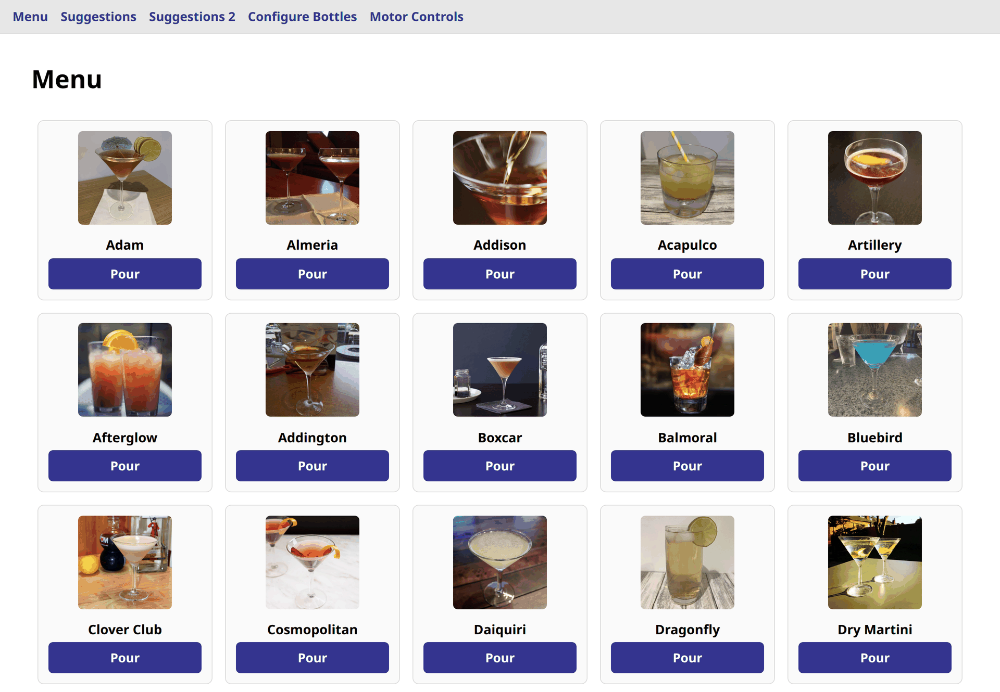
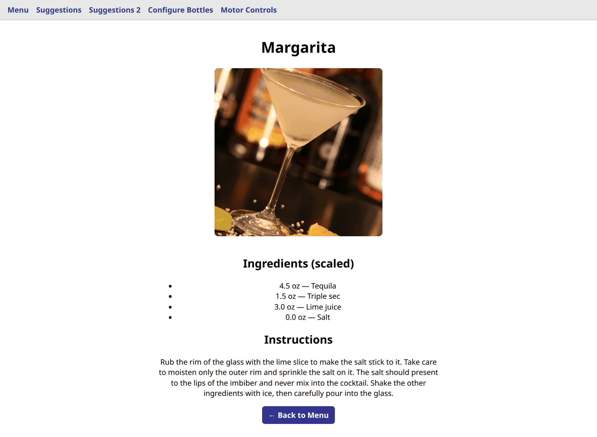
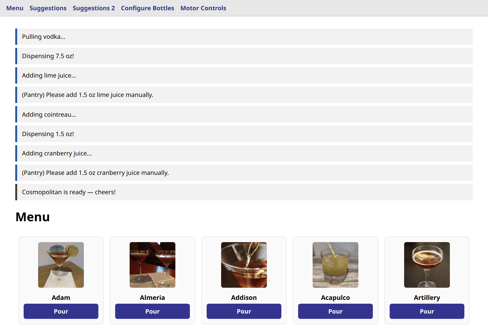
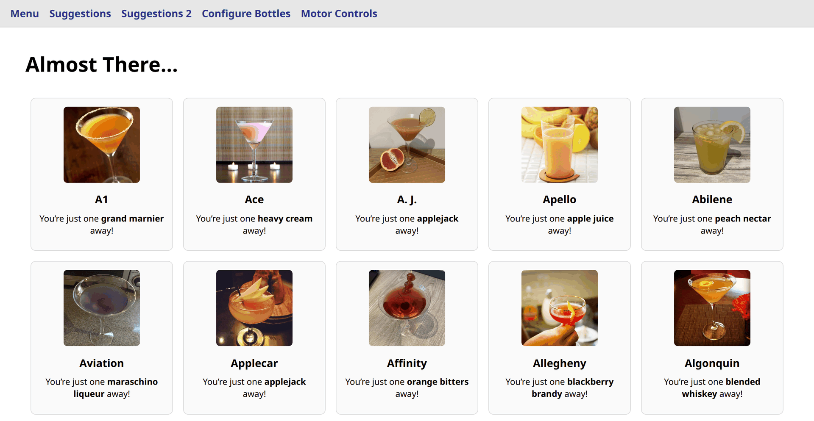
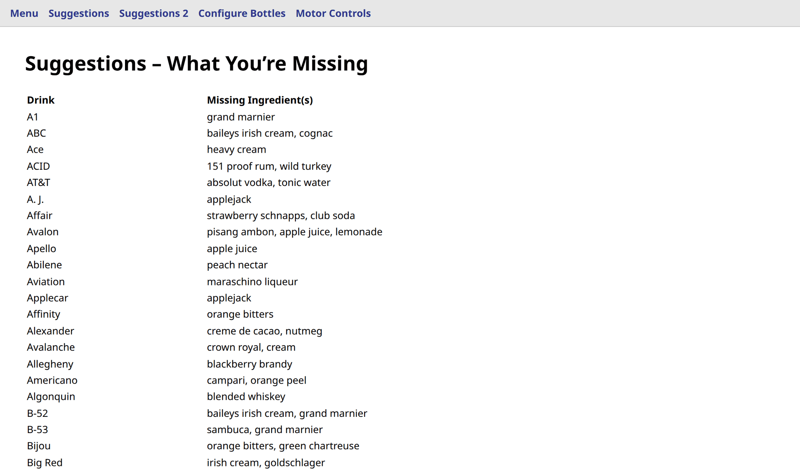
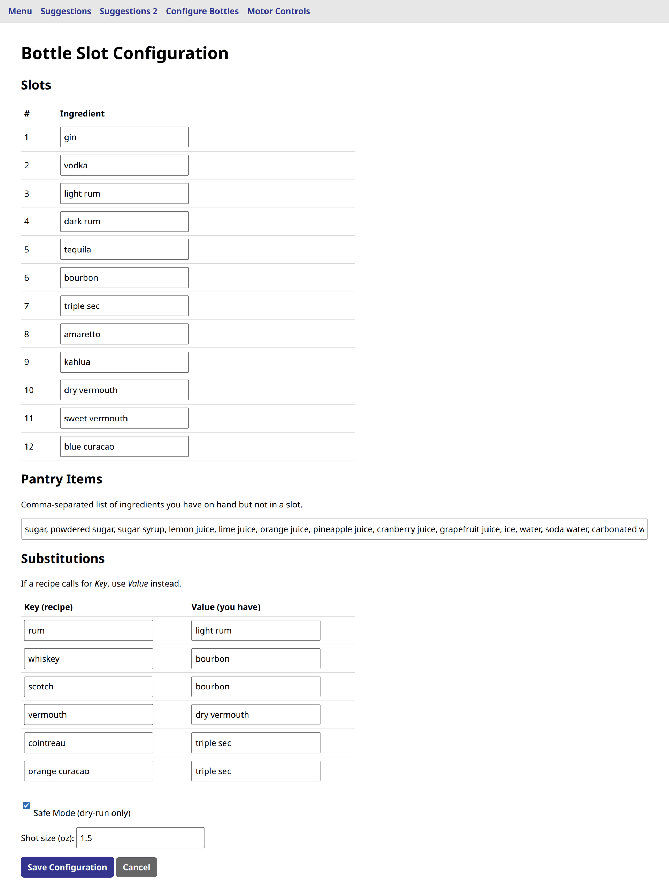
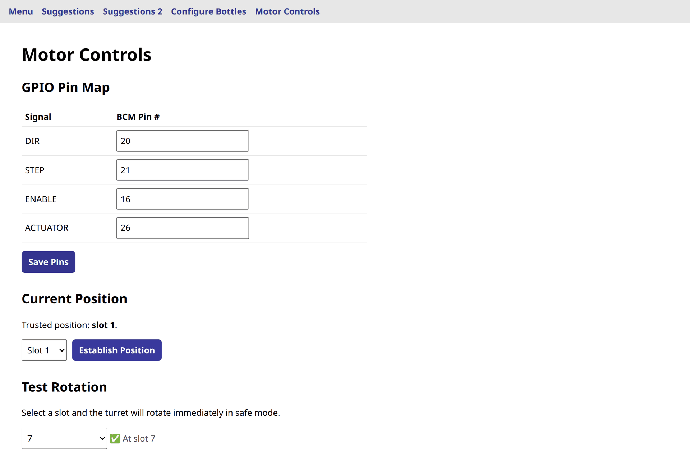

# BarRobot 🍸🤖

BarRobot is an open-source, 12-bottle cocktail turret controlled by a Raspberry
Pi, Flask touchscreen UI, NEMA-17 stepper, DM542T driver, and bottle-valve
actuator.


## What it does

- Builds a menu containing only drinks supported by the loaded bottles, pantry,
  and configured substitutions.
- Downloads and locally caches recipes from TheCocktailDB.
- Rotates the turret by the shortest path with conservative acceleration and
  deceleration.
- Dispenses configured shot increments and prompts for manual pantry additions.
- Provides safe-mode dry runs, GPIO configuration, position establishment, and
  individual-slot movement tests.
- Runs without Raspberry Pi GPIO in safe mode, including on development and CI
  machines.

## The UI

Flask serves five touch-sized pages at `http://<pi-address>:5000`. The shots
below come from a demo 12-bottle configuration running in safe mode.

### Menu



Only drinks supported by the loaded bottles, pantry, and substitutions appear.
Pour submits a POST, so a refresh or a crawler can never start a drink.

### Drink detail



Quantities are shown as the machine will pour them, rounded to whole increments
of the configured shot size.

### Pouring



The complete recipe is preflighted before the first bottle moves, then each step
reports which ingredient it is dispensing and which pantry items need a manual
top-up.

### Suggestions



Recipes you are exactly one ingredient away from making.

### Suggestions 2



Every recipe you cannot make yet, with all of its missing ingredients.

### Configure Bottles



Slot assignments, pantry contents, substitutions, shot size, and safe mode. The
form is validated as a whole, so a rejected edit never writes a partial config.

### Motor Controls



The pin map plus the trusted-position workflow. Because there is no homing
switch, live movement stays blocked until an operator aligns the turret and
establishes its slot here.

## Hardware

| Quantity | Component | Notes |
| --- | --- | --- |
| 1 | Raspberry Pi 4 or newer | Runs Flask and controls GPIO |
| 1 | 24 V / 5 A Mean Well LRS-120-24 | Shared power supply |
| 1 | DM542T stepper driver | Configured for 8× microstepping by default |
| 1 | NEMA-17, 1.8° stepper | Rotates the 12-slot turret |
| 1 | 24 V linear actuator | Presses bottle valves |
| 1 | 12-slot turret and support bearing | Carries bottles |

BarRobot does not yet implement automatic homing. Live motion is blocked after
startup until the operator aligns the turret and establishes its current slot
on the Motor Controls page.

## Install

BarRobot requires Python 3.10 or newer.

```bash
git clone https://github.com/cmc0619/barrobot.git
cd barrobot
python3 -m venv .venv
source .venv/bin/activate
python -m pip install --upgrade pip
python -m pip install -r requirements.txt
cp config.example.json config.json
python app.py
```

Open `http://<pi-ip>:5000`.

Set a persistent Flask session secret for deployment:

```bash
export BARROBOT_SECRET_KEY="replace-with-a-long-random-value"
```

`BARROBOT_PORT` changes the listen port. `BARROBOT_DEBUG=1` enables Flask debug
mode for local development; it is disabled by default and the reloader remains
disabled so a second process cannot control GPIO.

## First safe startup

1. Start with `safe_mode` set to `true`.
2. Confirm all 12 bottles, pantry items, substitutions, and BCM pins.
3. Measure the liquid delivered by one actuator press and set `shot_size` to
   that number of ounces.
4. Align the turret to slot 1 and choose **Establish Position** in Motor
   Controls.
5. Test all slots in safe mode, then live with bottles removed, then loaded.

Turning safe mode off deliberately invalidates its simulated position. Establish
the physical slot again before the first live movement.

The physical machine moves heavy bottles. Treat safe mode, position setup, and
calibration as commissioning steps, not decorative checkboxes.

## Configuration

Runtime settings live in the ignored `config.json` file. A v1
`bottle_config.json` is imported automatically when `config.json` does not yet
exist.

| Setting | Meaning |
| --- | --- |
| `api_key` | CocktailDB API key; `1` uses the free A–Z download path |
| `shot_size` | Calibrated fluid ounces delivered by one actuator press |
| `slots` | Exactly 12 ingredient names or `null` values |
| `pantry` | Ingredients the operator can add manually |
| `substitutions` | Recipe ingredient to available ingredient mapping |
| `safe_mode` | Suppresses all GPIO output when true |
| `pins` | Unique BCM pins for `DIR`, `STEP`, `ENABLE`, and `ACTUATOR` |

`COCKTAILDB_API_KEY` overrides the configured API key when it is present in the
service environment.

`recipes.json` is generated on the first successful CocktailDB download and is
then used offline. Delete it to rebuild the cache.

## Run as a service

The supplied unit expects the repository and virtual environment at
`/opt/barrobot`:

```bash
sudo cp systemd-barrobot.service /etc/systemd/system/barrobot.service
sudo systemctl daemon-reload
sudo systemctl enable --now barrobot
sudo systemctl status barrobot
```

Store `BARROBOT_SECRET_KEY` in an environment file and reference it from the
unit on a production machine.

## Development

```bash
python -m pip install -r requirements-dev.txt
pytest
ruff check .
```

The tests inject a recording GPIO adapter; they do not move physical hardware
or call CocktailDB.

## v2 compatibility

The route URLs, recipe-cache schema, 12-slot configuration, pantry,
substitutions, safe mode, GPIO pins, and movement profile remain compatible.
The documented correctness and safety changes include shot-size-aware actuator
counts, preflighted recipes, serialized movement, POST-first pours, trusted
startup position, and exact distribution of microsteps around the turret.

See [design.md](design.md) for the complete review, behavior contract,
intentional changes, architecture, and acceptance criteria.

## License

[MIT](../LICENSE) © 2025 Cliff Campbell (cmc0619)
