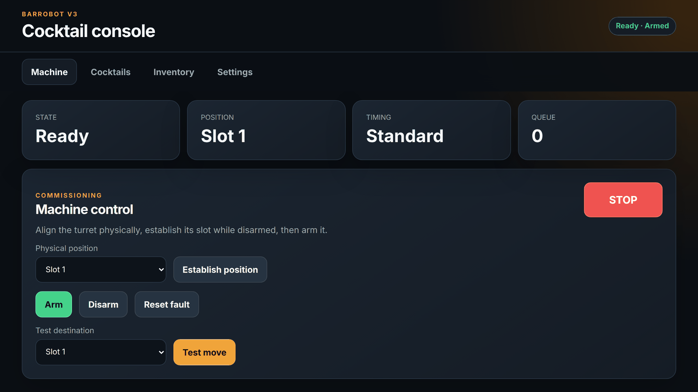
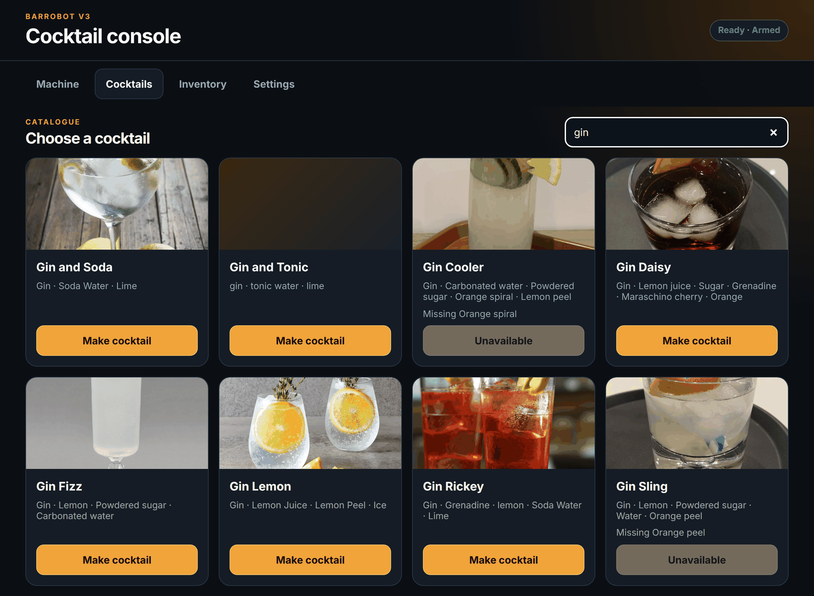
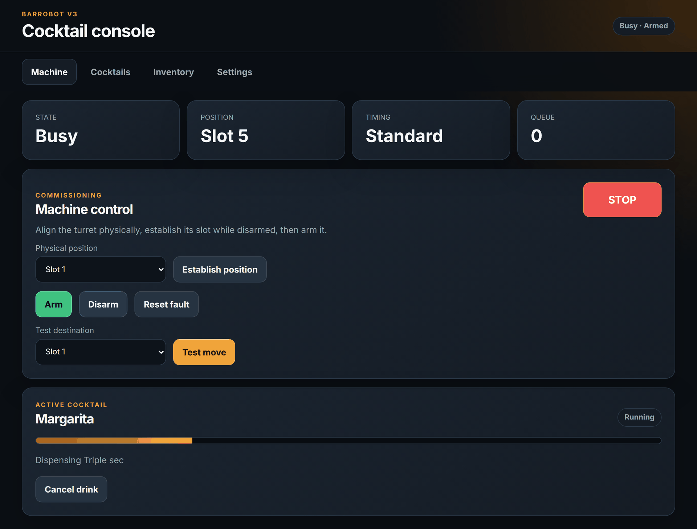
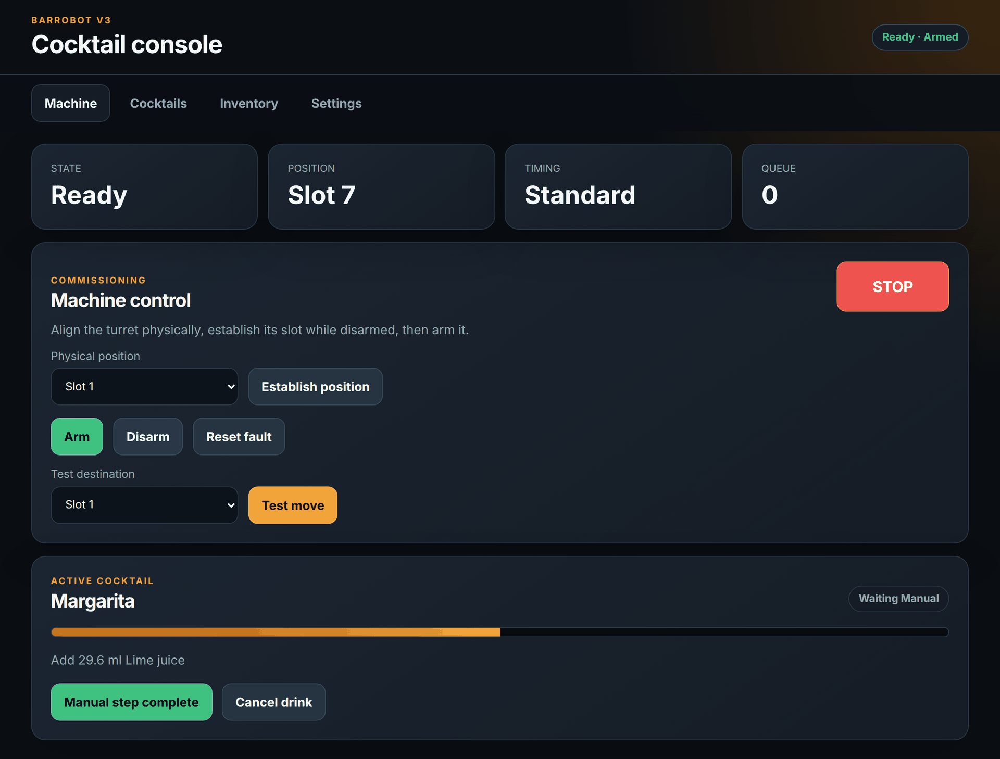
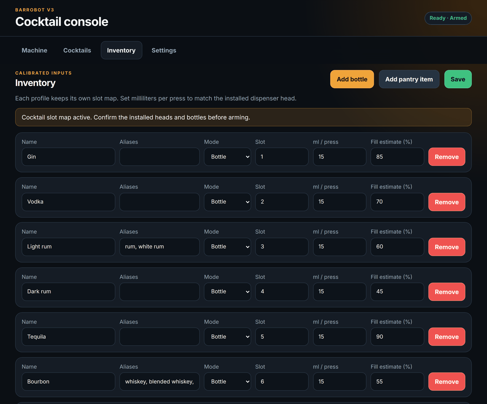
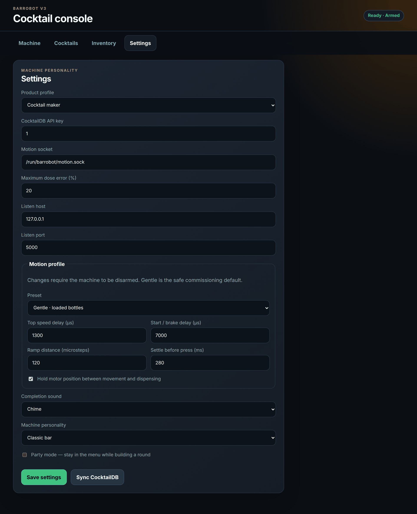

# BarRobot v3

BarRobot v3 is a greenfield controller for the existing 12-bottle Raspberry Pi
cocktail turret. It keeps the purchased Pi, DM542T, NEMA-17, actuator, power
supply, and wiring. It does not preserve the old Flask application, routes,
configuration, recipe scaling, or Python modules.


## The UI

One dependency-free touchscreen console with four tabs. These shots use a demo
12-bottle cocktail profile calibrated at 15 ml per press.

### Machine



Live machine state above the commissioning controls. The turret has been
aligned, its slot established, and the machine armed; STOP stays reachable from
every screen.

### Cocktails



The catalogue never hides a drink. Anything it cannot pour is disabled with the
specific reason — a missing ingredient, or a dose the installed head cannot hit
within the configured error tolerance.

### Pouring



A queued drink is planned in full before the turret moves. The panel tracks the
running step while the status cards show the machine busy at the slot being
poured.

### Manual steps



Ingredients that are not in a calibrated bottle pause the job instead of being
guessed. The machine waits for the operator to confirm the pour before it
continues.

### Inventory



Each bottle carries its own slot, aliases, calibration, and fill estimate. The
slot map belongs to the active product profile, so a cocktail-to-slushie
changeover never overwrites the other setup.

### Settings



Product profile, dose-error tolerance, motion preset with its individual timing
values, completion sound, and personality. Motion changes are only accepted
while the machine is disarmed.

## Architecture

Two services run on the Pi:

- `barrobot`: a strict TypeScript application on Node.js 24 LTS. It serves the
  touchscreen UI and API, validates recipes and inventory, calculates calibrated
  pours, persists state atomically, and runs one FIFO drink queue.
- `barrobot-motiond`: a native C11 daemon that exclusively owns the four GPIO
  lines through Linux GPIO v2. It controls step timing, ramps, actuator timing,
  position trust, arming, faults, and stop handling.

They communicate through `/run/barrobot/motion.sock`. HTTP code never owns GPIO,
and the motion daemon never accepts network traffic.

The full design and safety contract is in [docs/design-v3.md](docs/design-v3.md).

## Why a native motion service?

The DM542T needs a clean pulse train. Node is excellent for the application but
should not bit-bang a stepper from its event loop. The daemon schedules absolute
deadlines against `CLOCK_MONOTONIC`, so per-call latency does not accumulate
into positional drift. It uses the maintained Linux GPIO character-device API,
not retired Pi-specific GPIO packages.

No extra controller board or other hardware is required.

## Safety behavior

Every daemon start begins with:

- actuator low;
- step low;
- driver disabled;
- machine disarmed;
- turret position unknown.

Because the existing hardware has no implemented home sensor, the operator must
physically align the turret and establish its position before arming. Stop,
interrupted motion, daemon restart, GPIO failure, or timeout disarms the machine
and invalidates position.

No GET endpoint can move hardware. A drink is fully preflighted before it enters
the queue, and uncertain recipe measurements remain manual instead of being
guessed.

## Requirements

- Raspberry Pi OS with a current kernel exposing GPIO v2
- the existing BarRobot hardware
- Node.js 24 LTS
- GCC, GNU Make, and Linux kernel headers for building `barrobot-motiond`

The production systemd unit expects the header GPIO lines at
`/dev/gpiochip0`. Confirm this on the target Pi with `gpioinfo`; change the unit's
`--chip` argument if the header is exposed elsewhere.

## Development

```bash
npm ci
make check
make test
make all
```

The test suite does not access CocktailDB, a Unix motion socket, or GPIO. Native
motion tests use a fake backend and verify exact step counts under sanitizers.

Run the web application without hardware:

```bash
npm run dev
```

The UI will report the motion daemon as offline, but inventory, recipe, and
planning work remains available.

## Raspberry Pi installation

Install Node.js 24 LTS and build prerequisites first. From the repository:

```bash
sudo ./scripts/install.sh
```

The installer:

1. creates the unprivileged `barrobot` service account;
2. adds it to the Raspberry Pi `gpio` group;
3. builds the TypeScript application and C daemon;
4. installs under `/opt/barrobot`;
5. creates `/var/lib/barrobot` for state;
6. installs and starts both systemd units.

Open `http://<pi-address>:5000`.

## First commissioning

1. Leave bottles unloaded and select the **Gentle** motion profile.
2. Confirm `/dev/gpiochip0` represents the header GPIO and confirm BCM offsets
   20, 21, 16, and 26.
3. Start both services and confirm the UI reports **disarmed** and **position
   unknown**.
4. Physically align the turret with slot 1 and establish slot 1 in the UI.
5. Arm and test each slot with the turret unloaded.
6. Add bottles and measure milliliters delivered by one actuator press for each
   installed bottle.
7. Enter those calibration values in Inventory.
8. Test small recipes before normal operation. Only try Balanced or Quick after
   the fully loaded turret is repeatable and stable.

## Configuration

Application state is stored in `/var/lib/barrobot/state.json` using atomic
replacement. v3 does not read or migrate v1/v2 files.

Mechanical configuration is explicit in `deploy/barrobot-motion.service`,
including:

- GPIO chip and BCM offsets;
- slot count;
- motor steps and microsteps;
- default ramp length;
- default minimum and maximum half-period timing.

Changing DM542T microstep switches requires changing the service's
`--microsteps` argument to match.

The touchscreen Settings page stores and applies a motion profile while the
machine is disarmed. Gentle, Balanced, and Quick are conservative starting
points; Custom exposes top speed, launch/brake speed, S-curve distance, settle
time, and holding torque. Holding torque is scoped to automatic work and is
released when a job ends. The daemon enforces its own timing bounds even if a
client is compromised. It restores the saved profile after a daemon restart.

The product profile is mutually exclusive: select **Cocktail maker** or
**Slushie maker** while disarmed and with no work queued. The UI, catalogue,
and color theme switch together. Each product profile retains its own calibrated
slot map, so a physical changeover never overwrites the other setup. A later
cleaning workflow can be added as a separate maintenance profile without mixing
it into either product catalogue.

## Recipes and inventory

The first run includes small offline cocktail and slushie catalogues. CocktailDB
synchronization is visible only in the Cocktail maker profile, is explicit, and
is never required at startup.

Each bottle has:

- one unique zero-based physical slot;
- canonical ingredient name and aliases;
- configurable milliliters per press matching its installed dispenser head;
- actuator press and release duration.

Recipes are planned in milliliters. If the nearest whole press would exceed the
configured dose-error tolerance, the drink is unavailable until calibration,
inventory, or the recipe is corrected.

Recipes declare whether their ingredient order is `strict` or `flexible`.
Cocktails preserve their authored build order. Fully automatic flexible recipes,
such as a slushie flavour blend, are ordered from the live turret position to
reduce travel.

Bottle rows include an operator-maintained fill estimate. It is used only to
slow automatic moves by 25% or 50% when the turret is strongly lopsided; it
never speeds a move beyond the selected motion profile.

Party mode keeps the touch UI in the menu while orders are queued, and Classic,
Tropical, and Arcade personalities change the visual treatment and local
completion tones.

## Commands

```bash
systemctl status barrobot-motion.service barrobot.service
journalctl -u barrobot-motion.service -u barrobot.service -f
systemctl restart barrobot-motion.service barrobot.service
```

## License

[MIT](../LICENSE) © 2025–2026 Cliff Campbell
